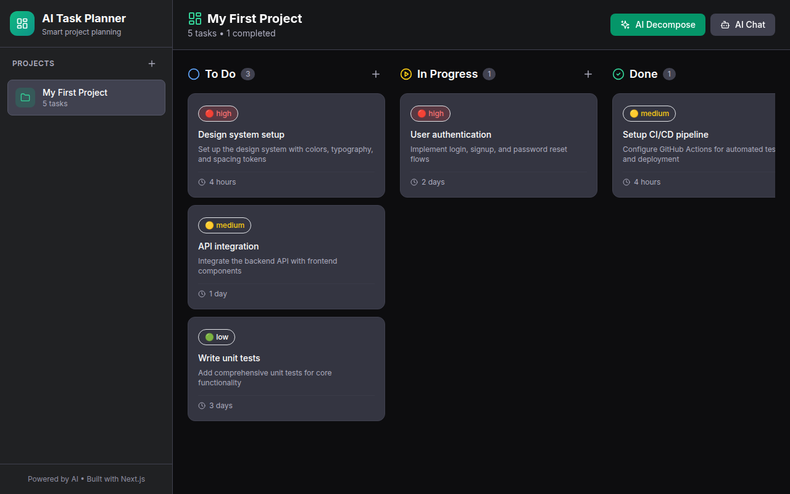

# AI Agent App - Powered by Mimo v2.5 Pro

## Dashboard Preview



---

# AI Task Planner 🚀

A beautiful, AI-powered task planning application built with Next.js 14, TypeScript, and Tailwind CSS. Break down your goals into actionable tasks using Mimo v2.5 Pro AI.

## ✨ Features

- **Project Management** - Create and organize projects with descriptions
- **Kanban Board** - Drag-and-drop style task management (To Do, In Progress, Done)
- **AI Task Planning** - Describe a goal and let AI break it into actionable tasks
- **Task Priority** - Set Low, Medium, or High priority for each task
- **Due Dates** - Track deadlines with visual indicators
- **Progress Tracking** - Visual progress bars for each project
- **Inline Editing** - Edit tasks directly in the board
- **Local Storage** - All data persists in your browser
- **Mobile Responsive** - Works beautifully on all devices

## 🛠️ Tech Stack

- **Framework**: Next.js 14 (App Router)
- **Language**: TypeScript
- **Styling**: Tailwind CSS
- **AI**: Mimo v2.5 Pro API
- **Storage**: Browser Local Storage

## 🚀 Getting Started

### Prerequisites

- Node.js 18+ 
- npm or yarn

### Installation

1. Clone the repository:
```bash
git clone <your-repo-url>
cd ai-task-planner
```

2. Install dependencies:
```bash
npm install
```

3. Set up environment variables:
```bash
cp .env.example .env.local
```

4. Add your Mimo API key to `.env.local`:
```
MIMO_API_KEY=your_actual_api_key_here
```

5. Run the development server:
```bash
npm run dev
```

6. Open [http://localhost:3000](http://localhost:3000) in your browser.

## 📖 Usage

### Creating a Project
1. Click "New Project" button
2. Enter project name and description
3. Click "Create"

### Adding Tasks Manually
1. Select a project
2. Click "Add Task" in any column
3. Fill in title, priority, and optional due date

### Using AI Planning
1. Select a project
2. Click "AI Plan" button
3. Describe your goal (e.g., "Launch a new marketing website")
4. AI will generate a structured task breakdown

### Managing Tasks
- **Edit**: Click the pencil icon on any task
- **Move**: Use the arrow buttons to move tasks between columns
- **Delete**: Click the trash icon to remove tasks

## 🌐 Deployment

### Vercel (Recommended)

1. Push to GitHub
2. Import project in [Vercel](https://vercel.com)
3. Add environment variable: `MIMO_API_KEY`
4. Deploy!

## 📁 Project Structure

```
ai-task-planner/
├── app/
│   ├── api/
│   │   └── ai-plan/
│   │       └── route.ts        # AI planning API endpoint
│   ├── globals.css             # Global styles
│   ├── layout.tsx              # Root layout
│   └── page.tsx                # Main application
├── components/
│   ├── KanbanBoard.tsx         # Kanban board component
│   ├── ProjectList.tsx         # Project sidebar
│   └── TaskCard.tsx            # Individual task card
├── lib/
│   └── storage.ts              # Local storage utilities
├── types/
│   └── index.ts                # TypeScript type definitions
├── .env.example                # Environment template
├── .gitignore
├── next.config.js
├── package.json
├── postcss.config.js
├── tailwind.config.ts
└── tsconfig.json
```

## 📄 License

MIT License

## 🙏 Acknowledgments

- Built with [Next.js](https://nextjs.org)
- Styled with [Tailwind CSS](https://tailwindcss.com)
- Powered by [Mimo v2.5 Pro](https://mimo.ai)
